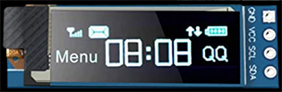

# ESP32-2022-BangWorx-Testing 
This is the NYLED ESP32 project adapted for these OLEDs: 

Works with Heltec builtin display or https://www.amazon.com/gp/product/B08CDN5PSJ
 

- FastLED included for using LED arrays instead of individual LEDs, this much less wiring and simpler to manage with magnitides more features.
- Base code is for the BangWorx master controller unit.
- This is pre web socket support.

See oled.h since this version can use two different displays:

### OLED 
 OLED_WIDTH 128  
 OLED_HEIGHT 32  
 OLED_ADDR 0x3C  
 PINS: SCL=IO22, SCA=IO21 (GPIO21/22)   

For the LED matrix or strip (partially outdated):

### MATRIX 
DATA_PIN = IO15  
NUM_LEDS = 256  
NUM_ROWS = 8  
NUM_COLS = 32  

Set NUM_ROWS=1 for LED Strips.

 **Project**  
 ESP32 Project with builtin OTA, HTTP Server, WiFi connectivity and About page. Only manual OTA updates (/update) are supported.
             
  **Summary**   

             Architecture: ESP32 specific.
            
  **Config**    
  You must update secrets.h with your WiFi credentials and the hostname you choose for this device. Currently using Elegant OTA.

             Pre-deloyment configuration checklist (all may not apply to this test project):
             
                1. Set NUM_LEDS, NUM_ROWS and NUM_COLS - NUM_ROWS=1 = single strip.
                2. Set <title> in htmlStrings.h <-->
                3. Set power max in main.cpp below (must match PSU used!).
                4. Set hostName in secrets.h
                5. Set ssid and password in secrets.h

  **Building**  
  pio run -t \<target> -e envName

  envName decides which display is used. esp32dev = chia display, heltec_wifi_kit_32 = heltec built-in.
             Examples:
                pio run -t upload, monitor -e heltec_wifi_kit_32
                pio run -t upload, monitor -e esp32dev
                pio run -t upload -e heltec_wifi_kit_32 --upload-port COM6
                pio run -t upload -e esp32dev
                pio run -t upload -e esp32dev --upload-port COM6

             List targets: pio run --list-targets
